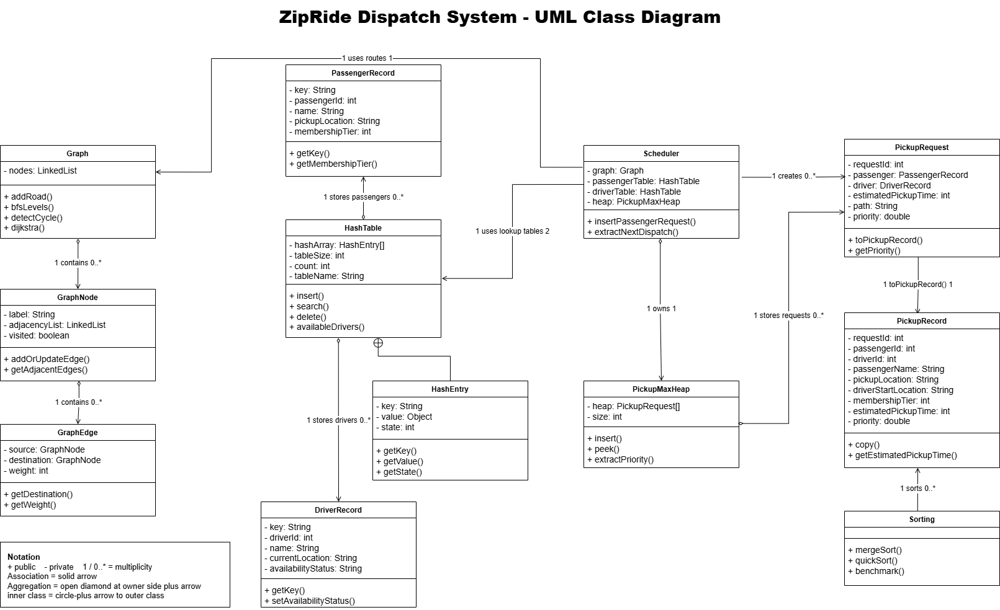
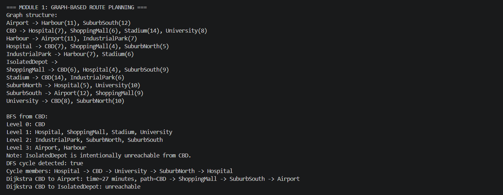
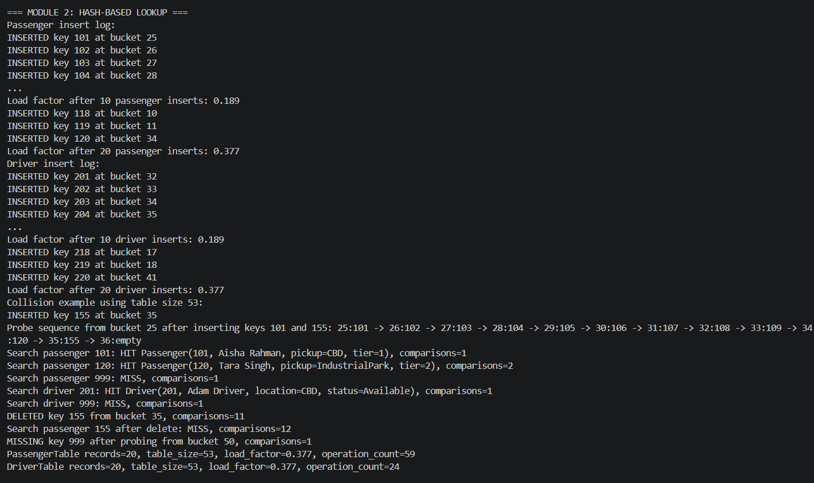
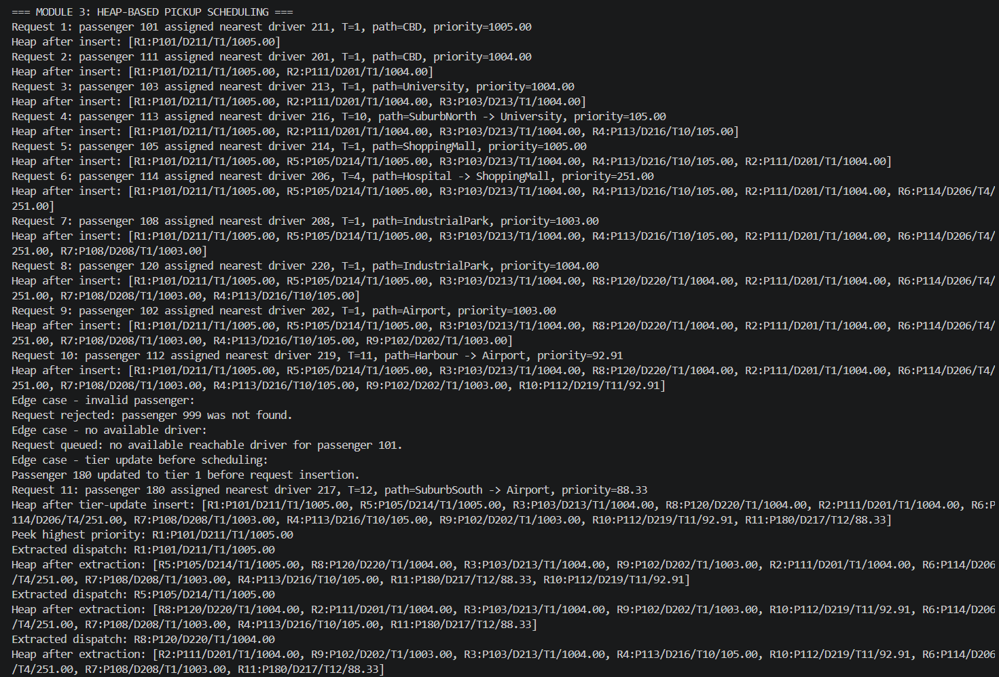
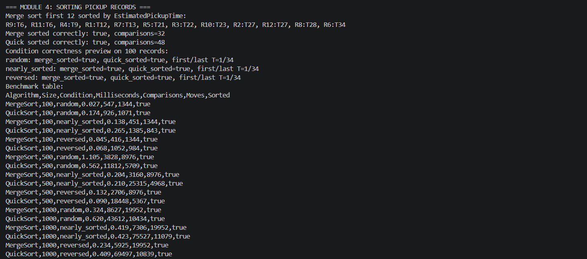

# COMP1002 Final Assignment Report

## 1. Overview

ZipRide is a small backend dispatch prototype for a ride-hailing company. My main goal was to make the four required data structures work together in one flow, instead of building four unrelated exercises. The graph stores the city roads, the hash tables store passengers and drivers, the heap decides which pickup should be handled first, and the sorting module prepares the end-of-day pickup report.

The system is divided into four modules:

1. Graph-based route planning
2. Hash-based passenger and driver lookup
3. Heap-based pickup scheduling
4. Sorting pickup records

The scheduler is the part that joins everything. When a pickup request is made, it looks up the passenger, checks the available drivers, uses the graph to estimate pickup time, and then places the request into the heap with a calculated priority score.

## 2. Data Structures Used

### 2.1 Graph

The road network is represented as a weighted, undirected adjacency-list graph. Each vertex stores a location name and its connected roads. Each road stores the destination location and the driving time in minutes.

I chose an adjacency list because the city graph is sparse. A real road location usually connects to a few nearby places, not every other place in the city. Because of that, an adjacency matrix would waste a lot of space. When I add a road, the program also adds the reverse road so the graph stays undirected.

Algorithms implemented:

- BFS groups reachable locations by level from a source.
- DFS detects whether a cycle exists and reports cycle members.
- Dijkstra computes shortest driving time and path between locations. I followed the free online OpenDSA explanation of shortest-path problems and Dijkstra's algorithm for this part (OpenDSA n.d.).

The test graph contains 11 locations, 12 weighted undirected roads, at least one cycle, and one isolated location named `IsolatedDepot`.

### 2.2 Hash Table

Passenger and driver records are stored in open-addressing hash tables with linear probing. The implementation uses a string-based hash function and then applies modulo to find the bucket:

```text
hashVal = (hashVal * 31) + key character
index = abs(hashVal) % table_size
```

The table size is 53. I chose this because it is a prime number and it is larger than the 40 required passenger and driver records. Using a prime size with modulo hashing helps spread keys more evenly, and the `31` multiplier helps different string keys produce different hash values.

The passenger and driver ID fields are still integers because that is what the assignment record format asks for. The lookup key used by the hash table is stored as a `String`, including inside each hash entry. Each hash entry uses getter and setter methods for the key, value, and state.

I used linear probing for collisions because it is simple to trace. When a bucket is already used, the program checks the next bucket until it finds an empty or deleted slot. Deletions use a deleted state instead of clearing the slot completely, so later searches do not stop too early.

Before inserting a new record, the table checks whether the next insert would push the load factor above 0.7. If so, it creates a larger table using the next prime number above double the current size, then rehashes only active entries. Deleted buckets are not copied, which helps shorten future probe chains.

The demo inserts 20 passenger records and 20 driver records. To make the collision handling visible, I inserted passenger IDs `101` and `155`, which both hash to bucket `25` when the table size is 53. The output prints the probe sequence so the collision resolution can be seen.

### 2.3 Max Heap

Pickup requests are scheduled with an array-based binary max heap. I used a max heap because the priority formula gives a larger score to a more urgent pickup. That means the request I want to dispatch first naturally belongs at the root.

The priority formula is:

```text
Priority = (6 - M) + 1000 / T
```

Here, `M` is the passenger membership tier and `T` is the estimated pickup time from the selected driver to the pickup location. Tier 1 is the highest passenger tier. If the driver is already at the pickup location, I use `T = 1`. This avoids division by zero, but still treats the request as an immediate pickup.

The heap implements:

- `insert(request)` with trickle up
- `peek()`
- `extract_priority()` with trickle down

The demo prints the heap array after every insert and extraction.

### 2.4 Sorting

The reporting module sorts pickup records by `EstimatedPickupTime` in ascending order. I implemented two comparison-based algorithms from scratch so their behaviour could be compared under different input conditions. The dataset setup starts from an ordered dataset, reverses it by swapping from both ends, creates random input with many swaps, and creates nearly sorted input by moving about 10 percent of the records. I used a fixed Java `Random` seed so the generated benchmark conditions are reproducible; Java's documentation states that the same seed and same method-call sequence produce the same sequence of values (Oracle n.d.).

Merge sort is implemented using a top-down recursive strategy. I chose this version because it is straightforward to trace and has predictable O(n log n) performance. It is also stable because records with equal estimated pickup times keep their relative order during merging.

Quick sort uses a median-of-three pivot strategy. I used this to reduce the chance of choosing a poor pivot for nearly sorted or reversed data. The implementation uses a `choosePivot` method and a `Partition` method that receives the pivot index. This quick sort is not stable because records can be swapped around equal keys.

## 3. Module Integration and UML-Style Data Flow

The data flow of my program is shown below. I included the UML screenshot as `report/zipride_uml.png`. I used a UML-style class interaction layout instead of only drawing a pipeline, because the scheduler uses several classes at the same time.



Figure 1: UML-style class interaction diagram for the ZipRide Dispatch System.

The scheduler is the main integration point. For each request, it gets the passenger by ID, scans the available drivers, runs Dijkstra to compare pickup times, chooses the nearest driver, calculates the priority score, and inserts the request into the heap. This is the part where the separate data structures start to feel like one system.

## 4. Algorithm Complexity

### 4.1 Graph

Let `V` be the number of locations and `E` be the number of roads.

| Operation | Time Complexity | Space Complexity |
|---|---:|---:|
| Add location | O(V) | O(1) additional |
| Add road | O(V + degree) | O(1) additional |
| BFS | O(V + E) | O(V) |
| DFS cycle detection | O(V + E) | O(V) |
| Dijkstra | O(V^2 + E) | O(V) |

Dijkstra's shortest-path algorithm is cited from OpenDSA (n.d.). In my implementation, I used a linear scan to find the smallest unvisited vertex instead of using Java's built-in priority queue. This is not the fastest possible version, but it keeps the implementation from scratch and easier for me to explain.

### 4.2 Hash Table

Let `n` be the number of records and `m` be the table size.

| Operation | Expected Time | Worst Case Time | Space |
|---|---:|---:|---:|
| Insert | O(1) | O(n) | O(n + m) |
| Search | O(1) | O(n) | O(n + m) |
| Delete | O(1) | O(n) | O(n + m) |

The worst case happens when many keys follow the same probe path. The program prints the load factor and uses a prime table size to reduce this risk. If an insertion would push the load factor above 0.7, the table resizes to the next prime size above double the current size and rehashes the active records.

### 4.3 Heap

Let `r` be the number of pickup requests in the heap.

| Operation | Time Complexity | Space Complexity |
|---|---:|---:|
| Insert | O(log r) | O(1) additional |
| Peek | O(1) | O(1) |
| Extract priority | O(log r) | O(1) additional |

Nearest-driver selection also scans available drivers and calls Dijkstra. If `d` drivers are available, request creation costs O(d(V^2 + E)) with the current Dijkstra implementation. This is acceptable for the small test graph, but it would need improvement for a much larger city.

### 4.4 Sorting

Let `n` be the number of pickup records.

| Algorithm | Best | Average | Worst | Space |
|---|---:|---:|---:|---:|
| Merge sort | O(n log n) | O(n log n) | O(n log n) | O(n) |
| Quick sort | O(n log n) | O(n log n) | O(n^2) | O(log n) average recursion |

Median-of-three pivot selection improves quick sort's behaviour on nearly sorted and reversed data, but it does not remove the theoretical O(n^2) worst case.

## 5. Sample Output

The complete Java sample output is stored in `sample_output/java_sample_run.txt`. The screenshots below show the terminal output for each module.

### Module 1 Output



### Module 2 Output



### Module 3 Output



### Module 4 Output



## 6. Benchmark Results

The Java benchmark data is stored in `sample_output/java_benchmark_results.csv`. The following table is from one run on the development machine:

| Algorithm | Size | Condition | Milliseconds | Comparisons | Moves | Sorted |
|---|---:|---|---:|---:|---:|---|
| MergeSort | 100 | random | 0.038 | 547 | 1344 | true |
| QuickSort | 100 | random | 0.049 | 926 | 1071 | true |
| MergeSort | 100 | nearly_sorted | 0.020 | 451 | 1344 | true |
| QuickSort | 100 | nearly_sorted | 0.059 | 1385 | 843 | true |
| MergeSort | 100 | reversed | 0.019 | 416 | 1344 | true |
| QuickSort | 100 | reversed | 0.031 | 1052 | 984 | true |
| MergeSort | 500 | random | 0.205 | 3828 | 8976 | true |
| QuickSort | 500 | random | 0.198 | 11812 | 5709 | true |
| MergeSort | 500 | nearly_sorted | 0.188 | 3160 | 8976 | true |
| QuickSort | 500 | nearly_sorted | 0.237 | 25315 | 4968 | true |
| MergeSort | 500 | reversed | 0.103 | 2706 | 8976 | true |
| QuickSort | 500 | reversed | 0.422 | 18448 | 5367 | true |
| MergeSort | 1000 | random | 0.485 | 8627 | 19952 | true |
| QuickSort | 1000 | random | 0.586 | 43612 | 10434 | true |
| MergeSort | 1000 | nearly_sorted | 0.231 | 7306 | 19952 | true |
| QuickSort | 1000 | nearly_sorted | 0.465 | 75527 | 11079 | true |
| MergeSort | 1000 | reversed | 0.296 | 5925 | 19952 | true |
| QuickSort | 1000 | reversed | 0.412 | 69497 | 10839 | true |

In my benchmark, merge sort was more consistent because it always divides the array and then merges in linear time. Quick sort was fast for some smaller cases, but it used more comparisons and moves in the larger tests, especially when the input was reversed. The median-of-three pivot helps, but repeated estimated pickup times can still produce less balanced partitions.

## 7. Reflection

This assignment helped me understand how separate data structures can be combined instead of only being tested one by one. Before I joined the modules together, each structure felt like a separate topic. After building the scheduler, it became much clearer how the graph, hash table, heap, and sorting module can support one dispatch workflow.

The main trade-off in my design is simplicity versus performance. Dijkstra is implemented with a linear scan instead of a heap-based priority queue. This is slower for very large graphs, but it is easier to follow and avoids using a built-in priority queue. For a real ride-hailing system, route estimates would need to be faster and probably cached.

The hash table part was useful because it showed why load factor matters. The operations are expected O(1) while probe sequences are short, but they can become slower if too many records collide and follow the same probe path. The deleted state was also a small detail that mattered more than I expected, because search still needs to move past removed entries.

For sorting, merge sort was the more predictable choice in my tests. Quick sort uses less extra memory on average, but its performance depends more on pivot quality and repeated key values.

## 8. Limitations and Assumptions

- The city graph is small and manually defined, so it does not represent a full real city.
- Road weights are static and do not model live traffic changes.
- Dijkstra uses O(V^2) vertex selection.
- When a driver is already at the pickup location, `T = 1` is used to avoid division by zero.
- Drivers are marked busy immediately when assigned to a pending request, so the same driver is not assigned to multiple queued pickups.
- Hash table resizing is implemented for load factors above 0.7, although the supplied 40-record test data remains below that threshold.
- Benchmark timings depend on machine load, so slightly different timings may appear on another computer.

## 9. Generative AI Declaration

No generative AI tools were used to generate code, report text, diagrams, or analysis for this assignment.

## 10. References

OpenDSA. n.d. "Shortest-Paths Problems." *OpenDSA Complete Catalog*. Accessed May 28, 2026. https://opendsa.org/OpenDSA/Books/Catalog/html/GraphShortest.html.

Oracle. n.d. "Class Random." *Java SE 17 & JDK 17 API Specification*. Accessed May 28, 2026. https://docs.oracle.com/en/java/javase/17/docs/api/java.base/java/util/Random.html.
